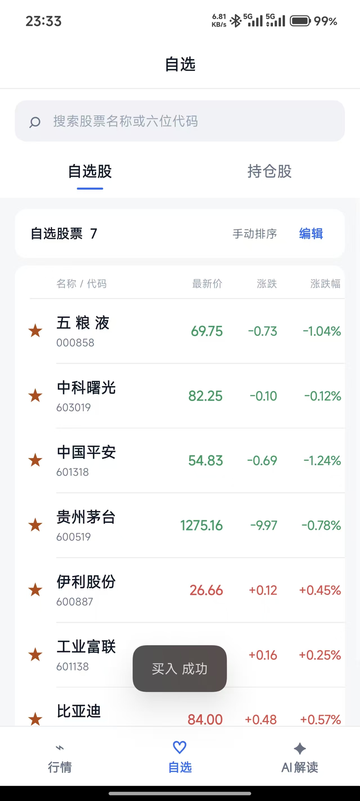
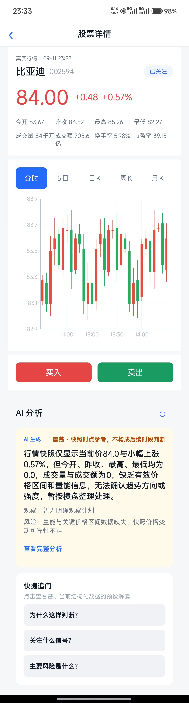
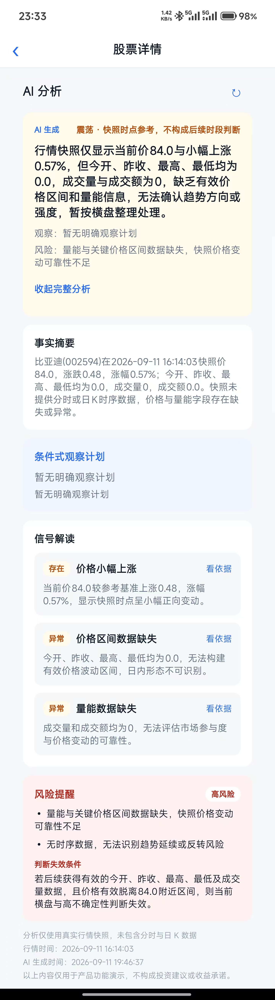

# KuiklyAIStock

基于 Kuikly 和 Kotlin Multiplatform 开发的股票行情 AI Demo。

## 行情首页

行情首页用于浏览市场和股票信息，提供股票名称、代码、最新价、涨跌幅等基础数据。页面包含搜索框、刷新入口以及“大盘 / 板块 / 个股”分类，可查看指数行情、涨跌统计、市场成交额、晚间复盘资讯和股票排行。点击股票后可进入个股详情页。

## 自选页

自选页用于集中管理关注的股票，支持在“自选股”和“持仓股”之间切换。自选股列表展示股票名称、代码、最新价、涨跌额和涨跌幅，并支持搜索、编辑买入、卖出和手动排序；持仓股进一步展示持仓数量、平均成本、市值和浮动盈亏，方便用户查看关注股票和持仓情况。

&nbsp;&nbsp;

## 个股详情页

个股详情页展示股票的实时行情，包括名称、代码、最新价、涨跌额、涨跌幅、今开、昨收、最高、最低、成交量、成交额、换手率和市盈率等信息。页面提供分时、5 日、日 K、周 K、月 K 等不同周期的走势图，并设置买入、卖出和关注入口。

详情页下方承载 AI 分析预览，用户可以查看行情摘要、风险提示，也可以通过快捷问题继续了解当前股票。

## AI 解读

AI 解读围绕当前股票行情生成结构化分析，主要包含：

- **事实摘要**：总结当前价格、涨跌和行情数据状态。
- **条件式观察计划**：根据当前数据给出后续观察方向。
- **信号解读**：解释价格变化、价格区间和成交量等信号。
- **风险提醒**：提示数据缺失、行情波动和判断失效条件。

分析结果通过卡片、标签和提示区展示，并标注行情时间和 AI 生成时间。当前内容主要用于产品功能演示，不构成投资建议。

### AI 功能技术实现

**Android 端已完整实现 DeepSeek AI 对接**，详见 [Android端AI功能实现说明.md](docs/Android端AI功能实现说明.md)。

**核心特性**：
- ✅ 对接 DeepSeek API（deepseek-flash 模型）
- ✅ 结构化 JSON 输出，强制符合预定义 schema
- ✅ 自动重试机制（网络错误/服务器错误）
- ✅ 完整错误分类处理（鉴权/额度/频率限制等）
- ✅ 数据库缓存（按股票代码 + 行情时间）
- ✅ Debug 模式启用真实 AI，Release 使用 Mock 数据

**配置方式**：在 `local.properties` 中配置 `DEEPSEEK_API_KEY=your_api_key`，Debug 构建自动启用。
