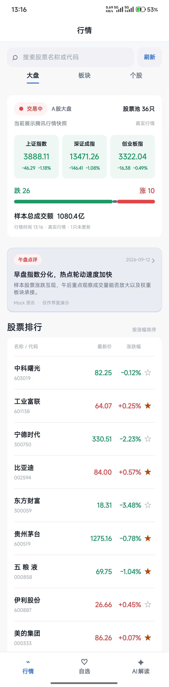
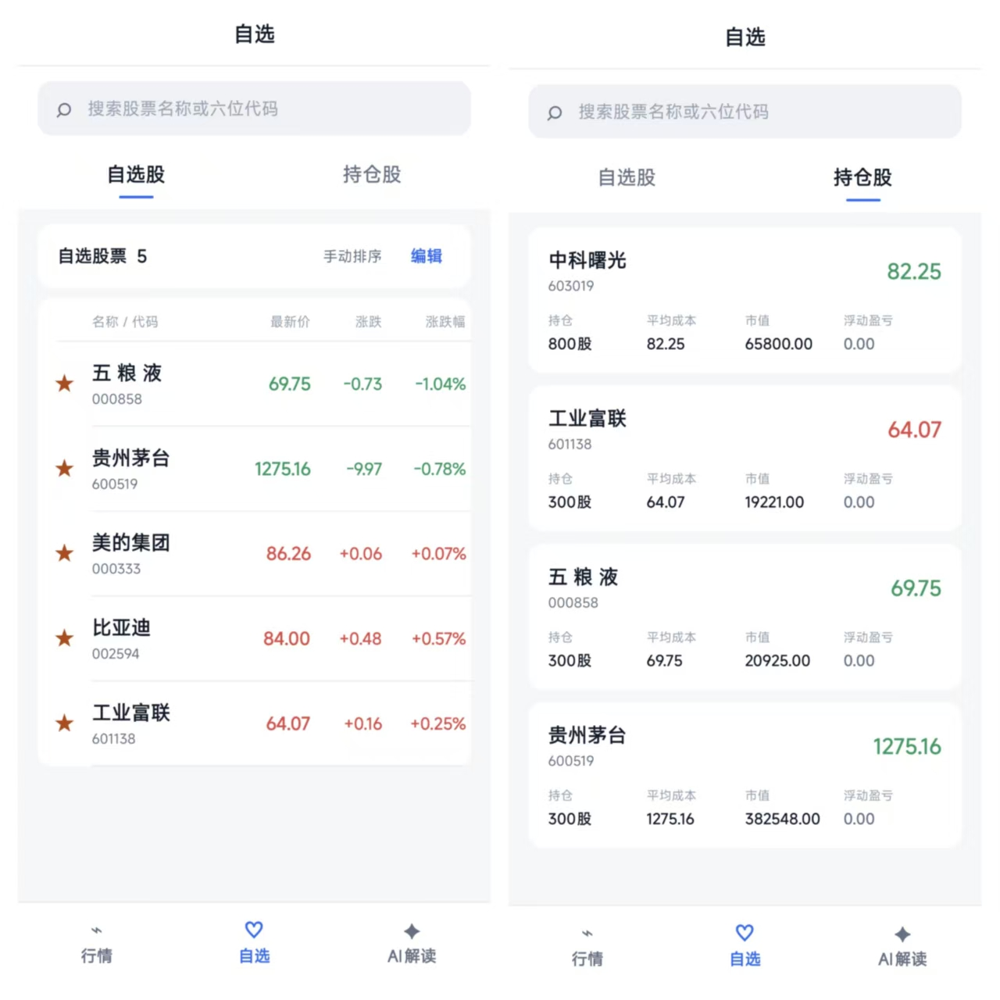
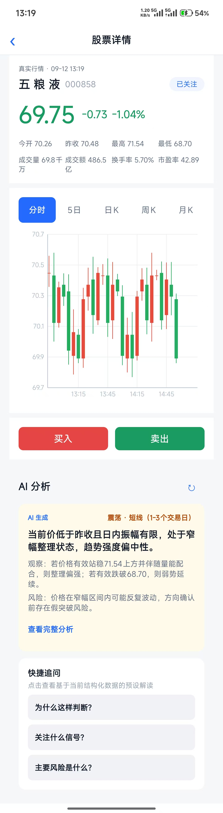
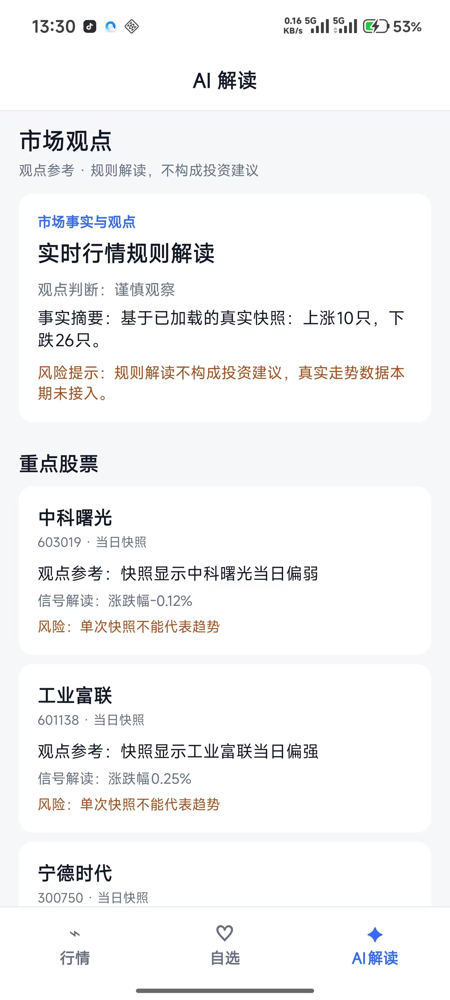
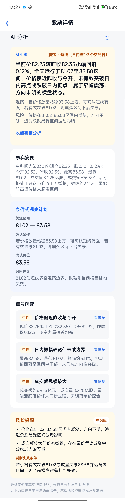
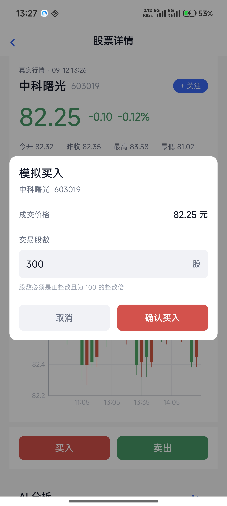

<div align="center">
  
  <h1>KuiklyAIStock</h1>
</div>

基于 **Kuikly + Kotlin Multiplatform** 开发的股票行情与 AI 解读 Demo，将行情浏览、自选管理、模拟持仓和个股分析串联在同一套 Kotlin 页面中。

项目以 Android 为当前主要运行入口，共享 UI 与业务逻辑位于 `shared/src/commonMain`。适合通过「查看行情 → 进入个股 → 阅读 AI 分析 → 管理自选与模拟持仓」演示完整交互链路。

> 本项目仅用于学习和产品原型演示，不构成投资建议，不提供真实证券交易。行情快照、模拟走势图、规则解读与远程 AI 结果的区别见下文。

## 演示视频与截图

### 功能演示视频

> [查看功能演示视频](./video/演示视频.mp4)

### 页面截图

| 行情首页 | 自选与持仓 | 个股详情 |
| :---: | :---: | :---: |
|  |  |  |

| AI 解读 Tab | 个股 AI 分析与预设问题 | 模拟交易弹窗 |
| :---: | :---: | :---: |
|  |  |  |


## 核心功能

### Task 1：股票行情

- **行情浏览**：查看指数与个股行情，支持名称 / 代码搜索、分类切换和刷新。
- **个股详情**：展示价格、涨跌及成交指标，支持分时、5 日、日 K、周 K、月 K 切换，图表使用模拟数据。
- **自选与持仓**：支持关注、排序、模拟买入 / 卖出，展示成本与盈亏，并保存本地状态。

### AI 解读

- **市场观点**：基于行情快照生成规则解读，点击重点股票可进入详情。
- **个股分析**：接入 DeepSeek，展示趋势判断、事实摘要、观察计划和风险提醒。
- **交互解读**：支持展开信号依据，以及判断原因、关注信号、主要风险三个预设问题。

## 项目亮点

| 亮点 | 实现方式 |
| --- | --- |
| 共享页面与业务 | 在 `commonMain` 中使用 Kuikly DSL 编写页面，使用 `observable` 管理响应式状态，宿主侧承接平台能力。 |
| 统一详情入口 | 行情、自选及 AI 股票卡片均复用 `stock_detail`，统一展示行情指标、图表、分析和交易入口。 |
| 结构化 AI 展示 | Prompt 约束 JSON 输出，共享仓储校验字段、枚举及价格区间，再映射为卡片，避免直接堆叠长文本。 |
| 缓存复用 | SQLDelight 保存行情与 AI 分析；远程分析仓储按股票代码查找缓存并比对行情时间，减少重复请求。 |
| 状态与异常处理 | 页面区分加载、空数据和失败状态；请求序号用于丢弃过期返回；AI 请求包含错误分类及有限重试。 |
| 一致的视觉规范 | `StockDesignTokens` 统一配色、间距和圆角，顶部与底部组件处理安全区，涨跌同时用颜色和正负号表达。 |

## 技术栈

以下版本取自当前仓库的构建配置，并非对各依赖最新版本的声明。

| 分类 | 技术 / 版本 |
| --- | --- |
| 跨端框架 | Kuikly Open `2.7.0-2.1.21` |
| 语言与共享模块 | Kotlin / Kotlin Multiplatform `2.1.21` |
| 页面实现 | Kuikly DSL、`@Page`、`BasePager`、`observable` |
| Android 构建 | Gradle Wrapper `8.5`、Android Gradle Plugin `7.4.2`、JDK `17` |
| Android SDK | compileSdk `34`、targetSdk `30`、应用 minSdk `23` |
| 本地数据库 | SQLDelight `2.0.1`，Android SQLite 驱动 |
| JSON | Kuikly JSON、kotlinx-serialization-json `1.6.0` |
| 图表 | 仓库内置 `third_party/KuiklyChart` 模块 |
| 行情接入 | 腾讯行情接口、股票代码映射与响应解码 |
| AI 接入 | Android Bridge + `HttpURLConnection`；仓库默认模型名为 `deepseek-flash` |
| 单元测试 | `kotlin.test`，测试位于 `shared/src/commonTest` |

## 架构与目录

### 分层职责

```text
Kuikly 页面 / 组件
  ├─ StockRepository → TencentStockRepository → 行情接口 / SQLDelight 缓存
  ├─ AiAnalysisRepository → BridgeAiAnalysisTransport → Android Bridge → DeepSeek
  │                       └─ SQLDelight AI 分析缓存
  └─ PortfolioStore → PortfolioPersistence → Bridge → Android 本地存储
```

- **页面层**：处理展示、交互、生命周期和路由，不直接承担行情解析或 AI 响应校验。
- **模型与仓储层**：统一行情、持仓、AI 分析模型，封装真实数据、缓存与 Mock 实现的边界。
- **宿主层**：Android 提供 Kuikly 渲染容器、路由适配、AI 网络请求及本地存储桥接。
- **测试层**：覆盖行情解析与仓储、AI 结构校验、自选 / 持仓、请求顺序及金额格式化等逻辑。

### 目录结构

```text
KuiklyAIStock/
├─ androidApp/                         # Android 运行入口
│  └─ src/main/java/.../
│     ├─ KuiklyRenderActivity.kt        # 默认加载 stock_home
│     ├─ adapter/                      # 路由、图片、日志等宿主适配
│     └─ module/KRBridgeModule.kt       # AI 请求与本地存储桥接
├─ shared/
│  ├─ src/commonMain/kotlin/.../
│  │  ├─ StockHomePage.kt              # 行情 / 自选 / AI 解读根页面
│  │  ├─ StockDetailPage.kt            # 复用的个股详情页
│  │  ├─ StockAiPage.kt                # 根 Tab 中的 AI 解读内容
│  │  ├─ StockAiAnalysis.kt            # 个股分析卡片与预设问题
│  │  ├─ StockTrendChart.kt            # 图表组件
│  │  ├─ StockDesignTokens.kt          # 设计 Token
│  │  ├─ base/                        # Pager 与 Bridge 基础能力
│  │  ├─ model/                       # 行情、分析及持仓模型
│  │  └─ repository/                  # 数据源、缓存与状态存储
│  ├─ src/commonMain/sqldelight/       # 行情、走势及 AI 缓存表定义
│  ├─ src/androidMain/                # Android 数据库与行情解码实现
│  ├─ src/jsMain/                     # JS 平台部分适配
│  └─ src/commonTest/                 # 共享逻辑测试
├─ third_party/KuiklyChart/            # 内置图表源码与上游说明
├─ iosApp/                            # iOS 宿主工程，默认构建未启用 iOS target
├─ ohosApp/                           # 鸿蒙宿主工程，使用独立构建配置
├─ buildSrc/                          # Kuikly 版本与构建常量
├─ docs/                              # 功能说明与设计记录
├─ ui_image/                          # 页面截图素材
└─ DESIGN.md                          # UI 设计规范
```

### 页面路由

```text
stock_home
  ├─ 行情 Tab ────────┐
  ├─ 自选 Tab ────────┼─→ stock_detail（参数：code）
  └─ AI 解读 Tab ─────┘
```

页面通过 `@Page` 注册，继承 `BasePager`，使用 `RouterModule` 跳转。当前注册的核心业务页面为 `stock_home` 和 `stock_detail`；`StockAiPage.kt` 是 Tab 内容组件，不是独立路由。

## 本地运行（Android）

**环境**：Android Studio、JDK 17、Android SDK 34，运行设备需 Android 6.0 / API 23 及以上。

1. 打开项目根目录，确认 `local.properties` 中的 `sdk.dir` 指向本机 SDK。
2. 如需远程 AI，在该文件添加 `DEEPSEEK_API_KEY=你的密钥`，仅 Debug 构建启用。
3. 完成 Gradle Sync，选择 `androidApp`，点击 Run。

也可在项目根目录执行命令构建 APK：

```powershell
.\gradlew.bat :androidApp:assembleDebug --no-daemon
```

产物：`androidApp/build/outputs/apk/debug/androidApp-debug.apk`。macOS / Linux 将 `.\gradlew.bat` 换为 `./gradlew`。

> 不要提交密钥或公开分发含真实密钥的 Debug APK。


### 编译与单元测试

```powershell
# 编译共享模块的 Android Kotlin 代码
.\gradlew.bat :shared:compileDebugKotlinAndroid --no-daemon

# 运行共享模块的 Android Debug 单元测试
.\gradlew.bat :shared:testDebugUnitTest --no-daemon

# 检查补丁空白与格式问题
git diff --check
```

### 验证结果

- ✅ `:shared:compileDebugKotlinAndroid`：编译通过。
- ✅ `:shared:testDebugUnitTest`：77 项测试全部通过，0 失败。
- ✅ `:androidApp:assembleDebug`：Debug APK 构建通过。
- ✅ `git diff --check`：通过。

## 补充文档

- [UI 设计规范](DESIGN.md)
- [页面实现说明](docs/页面实现说明.md)
- [行情缓存优化设计](docs/superpowers/specs/2026-09-11-quote-cache-optimization-design.md)
- [KuiklyChart 上游说明](third_party/KuiklyChart/UPSTREAM.md)

历史说明文档仅供参考；功能范围、路由与平台状态以当前源码及本 README 为准。